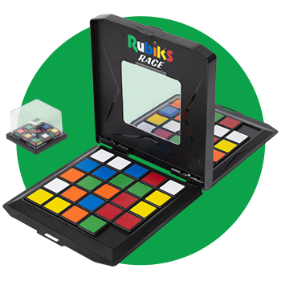

<div align="center">
  <h1>
    Rubik's Race Solver
  </h1>




[](https://github.com/JuandiGo1)
[](https://github.com/Slrosales)
[]((https://github.com/FernandoMVG))

</div>


Rubik Race Solver es una aplicación web que resuelve el juego Rubik's Race utilizando el algoritmo A* con una heurística basada en la distancia de Manhattan. Los usuarios pueden cargar un estado inicial y un estado meta en formato de archivo de texto y visualizar la solución paso a paso.


## 🚀 Tecnologías Utilizadas

- **Frontend:** HTML, CSS, JavaScript, Bootstrap 5
- **Backend:** Python (Flask)
- **Despliegue:** Vercel

## 📌 Características

- Carga de archivos de configuración inicial y meta.
- Visualización del nombre del archivo cargado.
- Backend en Flask para el procesamiento de soluciones.
- Visualización de la solución paso a paso.
- Desplegado en Vercel para acceso en línea.

## 🎯 Funcionamiento

1. El usuario sube dos archivos de texto:
   - **Inicial:** Representa la configuración inicial del tablero.
   - **Meta:** Representa la disposición objetivo a la que se debe llegar.
2. El backend procesa los archivos y ejecuta el algoritmo A*.
3. Se muestra la secuencia óptima de movimientos para alcanzar la meta.

## 📥 Formato de archivos

Los archivos deben ser **.txt** y tener el siguiente formato:

### 🔹 Estado Inicial
Debe contener una matriz de 5x5 con los colores representados por letras (A: Amarillo, B: Blanco, R: Rojo, N: Naranja, Z: Azul, V: Verde) y un `*` indicando el espacio vacío.

#### Ejemplo:
```
ABVZV
RBZNN
BB*RA
ZRNVZ
AAVRN
```

### 🔹 Estado Meta
Debe contener una matriz de 3x3 representando la disposición final deseada.

#### Ejemplo:
```
ZBB
RAV
NVA
```


## 🌐 Despliegue

El proyecto está en producción y accesible en el siguiente enlace:

🔗 [Rubik Race Solver](https://rubik-race.vercel.app)

## 🛠 Instalación y Uso

1. Clona el repositorio:
   ```bash
   git clone https://github.com/tu-usuario/rubik-race-solver.git
   ```
2. Accede al directorio del proyecto:
   ```bash
   cd rubik-race
   ```
3. Si deseas correr el backend localmente:
   ```bash
   cd api
   python app.py
   ```
4. Abre `frontend/index.html` en tu navegador o usa un servidor local.

## 🤝 Contribución

¡Las contribuciones son bienvenidas! Si deseas mejorar la aplicación, puedes hacer un fork del repositorio, crear una rama con tus cambios y enviar un pull request.

## 📜 Licencia

Este proyecto está bajo la licencia MIT. Puedes ver más detalles en el archivo [LICENSE](LICENSE).

---
Desarrollado con ❤️ por [ Juan Maestre, Laura Gomez & Fernando Valencia ]
